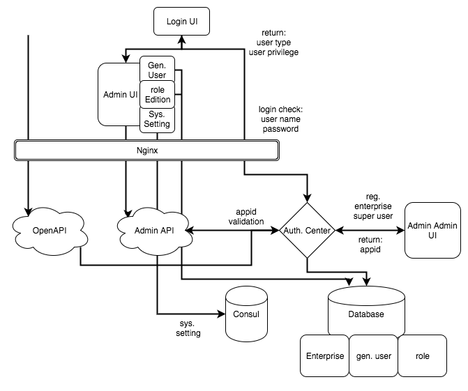

## 验证中心系統/管理端口

## 流程图


## API 列表

**驗證中心 (Auth. Center): appid/企業使用者管理**

端口 | 说明
------|-----
GET /auth/v1/validation | 验证 appid 是否合法, appid 放在 header 中
POST /auth/v1/user/login | 验证 user/pass 是否正确，回传 user\_name, user\_type, user\_privilege ...user_data

**驗證中心 (Auth. Center): 企業使用者管理**

端口 | 說明
----|-----
GET /auth/v1/enterprises | 列出所有企業帳號資訊，包含appid，企業使用者帳號；這個endpoint應該要拆到 admin api
GET /auth/v1/enterprise/\<enterprise_id> | 列出 \<enterprise_id> 資訊
POST /auth/v1/enterprise/register | 注册企业以及帐号使用者；这个端口應該要拆到 admin api，应该是独立的端口来跟 auth sys 沟通
PATCH /auth/v1/enterprise/\<enterprise_id> | 修改企業資訊
DELETE /auth/v1/enterprise/\<enterprise_id> | 刪除企業 (連帶刪除企業使用者，企業下的一般使用者，appid)

**管理端口 (Admin APIs): 一般使用者管理**

端口 | 說明
----|-----
GET /admin/v1/users | 列出所有使用者
GET /admin/v1/user/\<user_id> | 列出 \<user_id> 使用者資訊
POST /admin/v1/user/register | 註冊新使用者，包含角色
PATCH /admin/v1/user/\<user_id> | 修改使用者
DELETE /admin/v1/user/\<user_id> | 刪除使用者

**管理端口 (Admin APIs): 角色管理**

端口 | 說明
----|-----
GET /admin/v1/roles | 列出所有角色
GET /admin/v1/role/\<role_id> | 取得 \<role_id> 角色資訊
POST /admin/v1/role/register | 註冊新角色
PATCH /admin/v1/role/\<role_id> | 修改角色
DELETE /admin/v1/role/\<role_id> | 刪除角色

**管理端口 (Admin APIs) 系統設置**

端口 | 說明 
----|-----
GET /admin/v1/setting | 列出設定資訊
PATCH /admin/v1/setting | 修改設定


## Example

**GET /auth/v1/validation**

```
# Headers:
"Authorization": "your appid"

# Response
200 OK
403 Forbidden
```

**POST /auth/v1/user/login**

```
# Content-Type: application/x-www-form-urlencoded
user_name=$username
password=$password

# Response Valid
200 OK
{
    "user_id": "3c9ea76c03932ea28f6305de584cbe7b",
    "user_type": 0,
    "enterprise_id": "e1055c3475e765da92b783dbb4fcd2cb",
    "privilege": null,
    "role_name": null
}

# Response Invalid
403 Forbidden
```

**GET /auth/v1/enterprises**

```
# Response
[
    {
        "enterprise_id": "e1055c3475e765da92b783dbb4fcd2cb",
        "enterprise_name": "ECOVACS",
        "created_time": "2017-07-26 08:13:09",
        "industry": "金融",
        "phone_number": "0000000000",
        "address": "addr",
        "people_numbers": 50,
        "app_id": "e5435d108956079a8c8d3764cf367ca4",
        "user_id": "3c9ea76c03932ea28f6305de584cbe7b",
        "user_name": "ecovacs",
        "email": "ecovacs@test.com"
    },
    {
        "enterprise_id": "7cc5c9493e964b4a68f23c7139d97fb4",
        "enterprise_name": "ECOVACS2",
        "created_time": "2017-07-26 08:13:25",
        "industry": "金融",
        "phone_number": "0000000000",
        "address": "addr",
        "people_numbers": 50,
        "app_id": "5819d6e57b9c6447bdcdd6ee2de05a28",
        "user_id": "4c0e2d08283e1816e1d6e2cbff9a3f01",
        "user_name": "ecovacs2",
        "email": "ecovacs@test.com"
    },
    ...
]
```

**POST /auth/v1/enterprise/register**

```
# Content-Type: application/x-www-form-urlencoded
nickName=科沃斯
account=ecovacs
password=ecovacs@password
location=上海市
peopleNumber=50
industry=家電
linkEmail=ecovacs@ecovacs.emotibot.com
linkPhone=18898237471993333
apiCnt=500
expTime=1489123847
anaDuration=3600

# Response Success
200 OK

# Response with Error
200

{
	"status": $error_code
	"message": $error_message
}
```

**PATCH /auth/v1/enterprise/<enterprise_id>**

TBD


